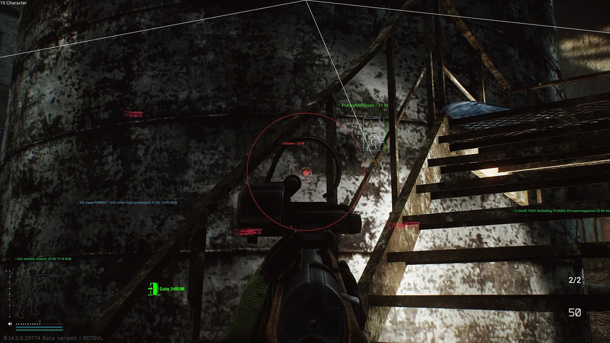
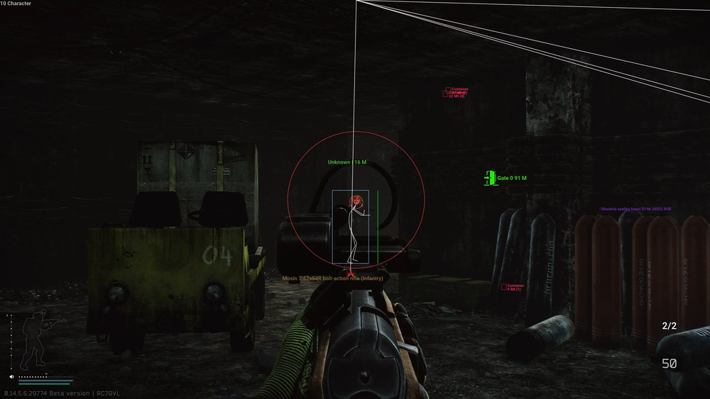
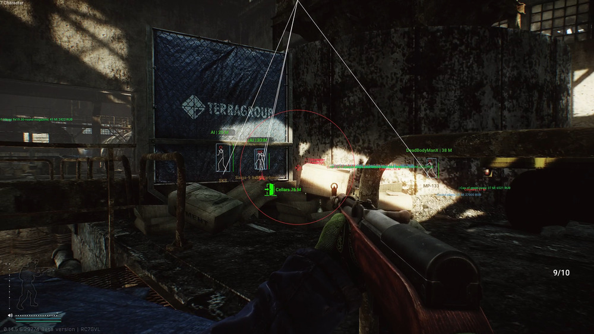
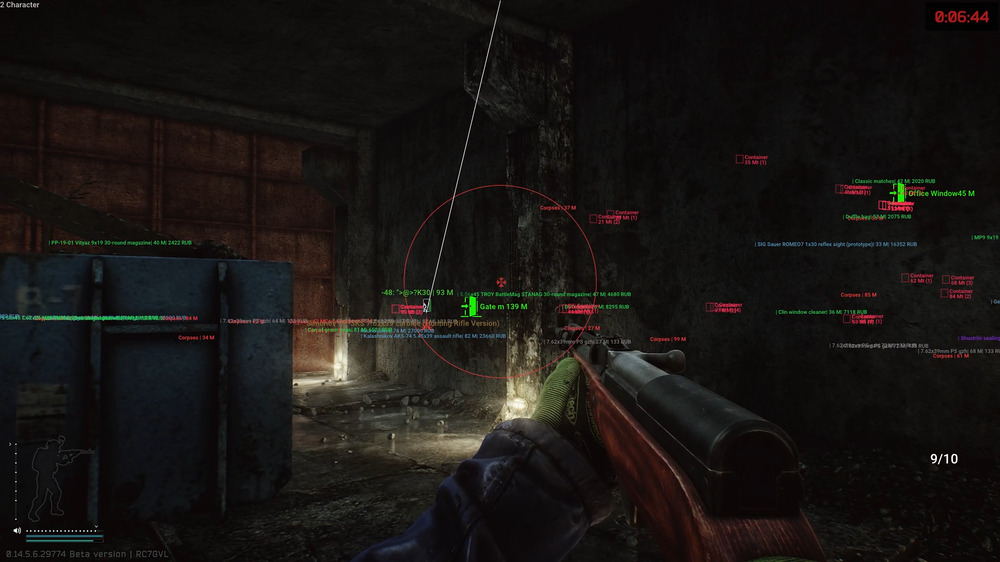

## 🎮 Escape From Tarkov with Inferno Cheat Hack 🎮

---

  

### 🌟 Introduction 🌟
Escape From Tarkov is an intense and immersive game that demands strategic thinking and quick reflexes. For those looking to enhance their gameplay, exploring advanced features and tools can provide significant advantages.

---

  

### ⚙️ System Requirements ⚙️
To ensure optimal performance and compatibility, keep the following requirements in mind:

- **Operating System:** Compatible with Windows 10 and Windows 11 (all versions supported).
- **Interface:** User-friendly English menu.
- **Security:** Enhanced with HWID lock.
- **Compatibility:** Secure boot in BIOS must be disabled.

---

  

### 🚀 Key Features 🚀
Inferno Cheat Hack offers a range of features designed to enhance your gaming experience:

#### 🔍 Enemy Detection
- **Enemy ESP:** Detect enemies through obstacles for better situational awareness.
- **Enemy Info:** Access real-time data including distance, bot status, and skeletal structure.

#### 🎯 Precision Aiming
- **Accurate Aimbot:** Customize settings for pinpoint accuracy.
- **Aim Key Selector:** Choose your preferred key for aim activation.
- **Smoothness & FOV Customization:** Adjust aiming sensitivity and field of view to match your playstyle.
- **Aim Bone Selector:** Target specific body parts for precise shots.

#### 🛠️ Enhanced Looting
- **Nearby Items ESP:** Identify valuable items with price filtering for efficient looting.

#### 💪 Stability Mods
- **No Recoil / Sway Mods:** Stabilize your weapon for improved accuracy and control.

---

### 📋 Usage Guide 📋

  

#### 🔧 System Preparation
1. Ensure your system meets the specified requirements.
2. Disable Secure Boot in BIOS settings for compatibility.

#### 💾 Installation
1. Extract the Inferno Cheat files to a preferred location on your PC.
2. Run the executable file with administrator privileges.

#### 🔑 Activation
1. Access the English menu interface upon activation.
2. Utilize the HWID lock feature for added security.

#### 🎮 In-Game Usage
1. Activate Enemy ESP and Enemy Info to gain a tactical advantage.
2. Customize aim settings, including aim key, smoothness, and FOV.
3. Utilize aim bone selection for targeted shots.
4. Enhance looting efficiency with Nearby Items ESP and price filtering.
5. Enjoy stabilized aiming with No Recoil / Sway Mods.

---

### 📌 Conclusion 📌
By leveraging the advanced features of Inferno Cheat Hack, players can significantly enhance their Escape From Tarkov experience. Whether you are aiming for precision or efficiency, these tools can help you achieve your gaming goals.

**Disclaimer:** Using cheats can violate the terms of service of the game. Use them responsibly and at your own risk.

---

This version uses vibrant emojis and clear formatting to make the content more engaging and visually appealing, while ensuring it complies with GitHub's guidelines.
